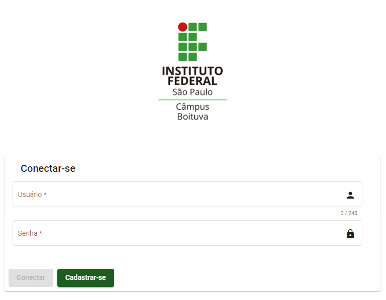
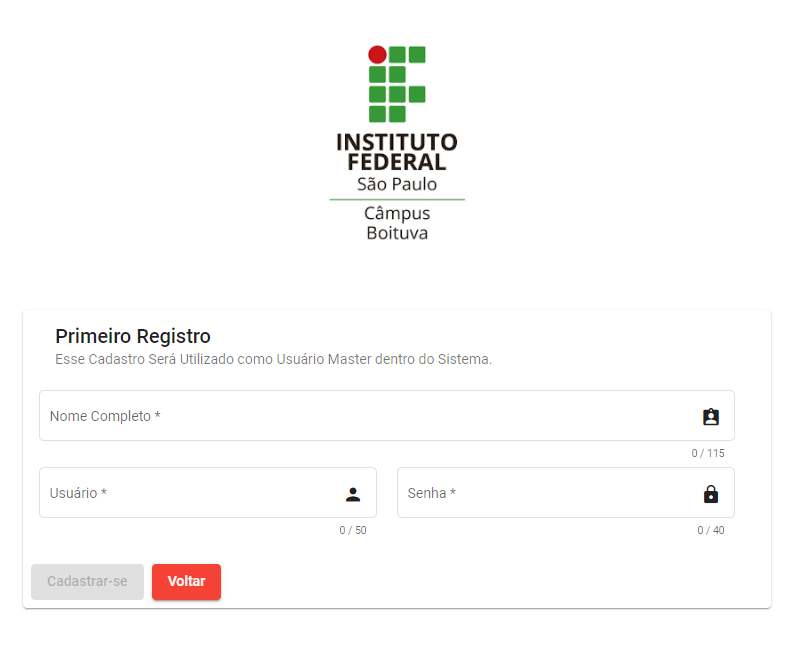
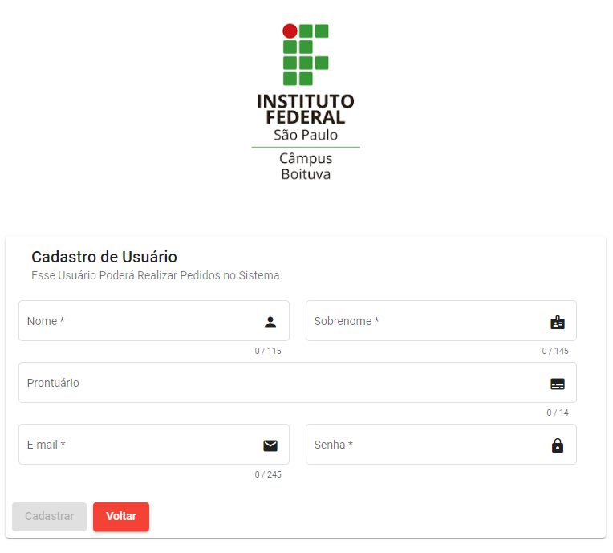

# OrderCLI

Sistema de Gerenciamento de Pedidos, para a Cantina do IFSP - Boituva, com o Intuito de Reduzir as Filas nos Intervalos dos Cursos.

## Sumário

1. [Primeiro Acesso](#primeiro-acesso)
   1. [Criando Primeiro Usuário](#criando-primeiro-usuário)
   2. [Criando Usuário](#criando-usuário)
2. [Cadastros](#)
   1. [Categoria](#)
   2. [Produto](#)
   3. [Método de Pagamento](#)
   4. [Usuários](#)

## Primeiro Acesso

Ao Abrir o Sistema Pela Primeira Vez a Tela de Conexão Será Exibida. 

    

## Criando Primeiro Usuário

Neste Caso Não Temos Uma Conta Ainda Registrada no Sistema, Precisamos Criar Nosso Primeiro Usuário. Para Isso Vamos Modificar a Url do Site Para a Seguinte. **http://{DOMINIO}/firstRegister**. 

Indo Para Essa Nova Página nos Deparamos com a Tela de Cadastro.

    

Para Realizar o Cadastro Basta Preencher as Informações Necessárias, Feito Isso Basta Clicar no Botão **Cadastrar-se**. Se Tudo Ocorrer bem, Você Será Redirecionado Para a Tela de Conexão. Agora Basta Utilizar o Mesmo Usuário e Senha Cadastrados para Efetivar o Acesso. **Lembrando que Esse Primeiro Usuário Será o Usuário Master Dentro do Sistema. (Você só pode Realizar Uma Vez o Primeiro Registro.)**

## Criando Usuário

Neste Caso Vamos Criar um Usuário Tradicional Simulando um Cliente neste Caso um Aluno. Na Tela de Conexão Basta Clicar em **Cadastrar-se** Você Será Redirecionado para Tela de Cadastro do Usuário.

    

Após o Preenchimentos dos Dados Necessários, Basta Clicar no Botão **Cadastrar**, Se Tudo Ocorrer bem, Você Será Redirecionado Para a Tela de Conexão. Feito Isso Basta Utilizar o Mesmo E-mail e Senha Cadastrados para Efetivar o Acesso.
